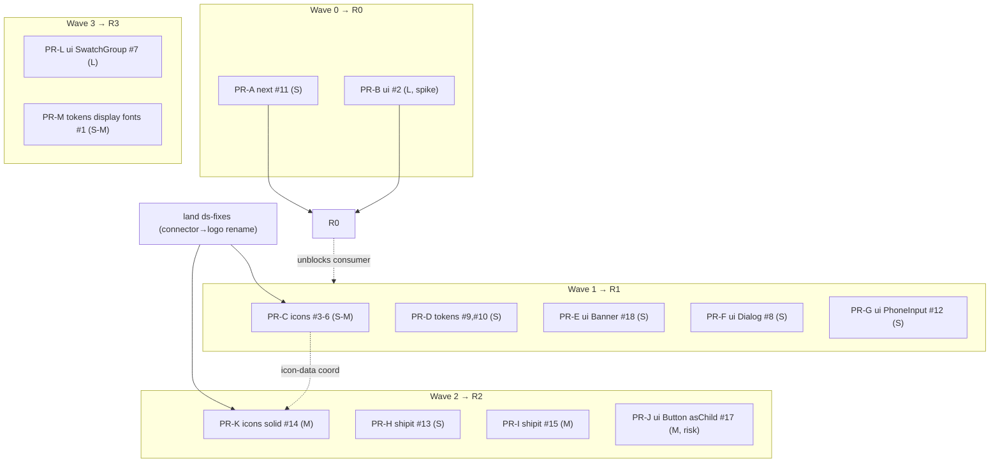

# Ship-It DS — upstream-gaps roadmap (JP Euro feedback)

## Goal

Fix, upstream in this monorepo, the 18 gaps a consuming project (JP Euro mockup)
hit while building against **published** `@ship-it-ui/*` packages. Ship as
sequenced, independently-revertable PRs grouped into waves; cut a release after
each wave so the consumer can drop its interim workarounds.

## Why

The consuming team records gaps instead of building local workarounds (their
standing instruction: leverage-ship-it-design-system). Two gaps fully **block**
npm consumers (every DS component renders unstyled; the metadata helper is
unusable). The rest are additive, non-breaking API/token/icon gaps. The consumer
runs on **published** packages that lag `main`, so several reported gaps are
already fixed in-repo and only need a release.

## Success criteria

1. A fresh **external (non-workspace)** app installing `@ship-it-ui/ui` renders
   DS components fully styled — verified by the existing `snapshot.yml`
   pr-`<n>` dist-tag publish, not a manual throwaway app.
2. `buildMetadata` is importable from `@ship-it-ui/next/server` and usable in a
   Server Component `export const metadata` without an RSC `'use client'` throw —
   proven against the **built** `dist/server.*` bundle.
3. Every other confirmed gap has a shipped, non-breaking fix with a changeset.
4. No existing consumer breaks (all additive); `docs-site` still builds + renders.
5. Each wave ends in a published release.

## Non-goals

- No breaking changes; no 1.0 cut. All changesets `patch` (repo policy:
  [[v0-changeset-patch-policy]]).
- Not fixing the consuming app; only the DS.
- Not building local workarounds in the consumer.

## Constraints

- pnpm workspace + changesets; release via `release.yml`; PR validation via
  `ci.yml`, `audit.yml`, `changeset-check.yml`; real external install via
  `snapshot.yml`.
- Tailwind v4 (`4.0.0-beta.3`), CSS-first `@source`, no `tailwind.config`.
- `packages/icons/src/icon-data.ts` is **committed + drift-tested** (regenerate
  or CI fails) — see [[drift-test-for-codegen]], [[icons-readme-codegen-drift]].
- `packages/tokens/styles/tokens.css` is **gitignored/generated** (only
  `.gitkeep` tracked) — there is **no committed CSS to conflict on**.
- Standing instructions: no Co-Authored-By/Claude commit trailer
  ([[no-signature-in-commits]]); stack fixes on the active branch, per-batch
  commit permission ([[feedback_no_autonomous_commits]], [[feedback_pr_scoping]]).
- Scar: undeclared workspace deps hide locally; strict-resolution masks them
  ([[ci-strict-resolution-masks]]) — every package touched must declare its deps.

## Audit corrections (folded in — several of my own discovery claims were stale)

A 4-persona adversarial audit (standard mode) surfaced 26 confirmed findings.
The load-bearing corrections:

- **#16 is mostly already shipped.** Commit `d4e29e1` added ~14 car makes from
  `simple-icons`. Re-verified: only **7 makes are genuinely absent** from
  simple-icons — `lotus, genesis, lexus, dodge, gmc, lincoln, mercury` — so #16
  is correctly scoped to exactly those 7 custom-SVG marques (licensing question
  is real, but only for 7, not "M-L + every make").
- **The in-flight `connector→logo` rename (branch `ds-fixes`) MUST land first.**
  It rewrites `icon-data.ts` keys `connector:`→`logo:` and renames
  `connectorManifest`→`logoManifest`. Every icons PR here must build on
  `logoManifest`/`LogoName` and branch from a `main` that already has the rename.
  Tracked: [[rename-connector-icons-to-logos]].
- **`tokens.css` is gitignored** → the "tokens regen-conflict batching" rationale
  is false. Tokens PRs are independent.
- **#2 precompiled CSS is NOT self-service.** It only carries DS-component
  classes (consumer's own utility classes still need their own Tailwind), bakes
  in the Tailwind-beta preflight (double-reset risk vs a consumer's Tailwind),
  and uses bare-specifier `@import`s that may not resolve in every consumer
  toolchain. Reframed below.
- **#11 `buildMetadata` is already exported from the root `index.ts`** (a
  `'use client'` trap). Fix = add to `/server` too; the regression test must
  assert the **built** `dist/server.*` carries no hoisted `'use client'` (TS
  source can pass while the bundle still traps).
- **Release-cascade ordering claim was wrong.** changesets versions the whole
  affected dependency graph **atomically** in one version PR — there is no
  manual "release tokens before ui before shipit" step.
- **#8 `VisuallyHidden` is a phantom/transitive dep** — re-exporting Radix's
  needs a direct `@radix-ui/react-visually-hidden` dependency or it breaks under
  strict installs; alternatively ship a 2-line local `sr-only` primitive (no dep).
- **Scope-creep flags (pragmatist):** SwatchGroup (#7) is net-new, composable
  from shipping primitives; the display-font program (#1) is just a missing
  family token (the type _scale_ already exists) blocked on a brand choice. Both
  kept (user opted in) but parked in Wave 3 at lowest priority.

## Design decision — #2 CSS publishing (needs a design spike before PR-B)

Scored options (effort / risk / reversibility / blast-radius):

| Opt | Approach                                                          | E   | R        | Rev   | Blast |
| --- | ----------------------------------------------------------------- | --- | -------- | ----- | ----- |
| A   | Precompiled utility CSS entry (`dist/styles/*.css`)               | M   | **high** | hard¹ | med   |
| B   | Publish-correct `@source → ./dist` in globals.css                 | S   | med      | easy  | med   |
| C   | Documented consumer `@source` line(s) + consumer-safe globals.css | S   | low      | easy  | low   |

¹ Once published, a CSS entry path is effectively permanent API; removing it is
breaking (production-9).

**DECIDED (2026-06-16, OQ-1 resolved): Option C** (documented `@source` +
consumer-safe globals.css), with B's correctness baked in. A precompiled CSS
entry (Option A) is explicitly out of scope.
The consumer's _own_ working interim fix is exactly Option C
(`@source '../node_modules/@ship-it-ui/ui/dist/**/*.js'`), which is the standard
Tailwind-v4 pattern for a node_modules component lib. So:

1. Make the **published** `globals.css` consumer-safe: drop the broken
   `../../../shipit/src/**` and `../../../../apps/docs-site/**` `@source` lines
   (they resolve to nonexistent consumer paths). Split a **monorepo-only** entry
   from the **consumer** entry so `docs-site` keeps scanning `ui`+`shipit` _src_
   (production-4) while consumers get a clean file.
2. **Document** the required consumer `@source` lines for `ui` (and `shipit` if
   used) dist, in the package README + an install guide.
3. Add a **migration note + a dev-only console warning** for the silent-unstyled
   failure mode (production-10) — the failure is invisible (unstyled, not thrown).
4. Treat **precompiled CSS (Option A) as a deferred, optional** secondary entry
   for non-Tailwind consumers only, with the beta-preflight caveat documented —
   NOT the headline fix, and NOT in the publish-blocking `validate` gate on a
   beta engine (devops-3).
5. Verify with `snapshot.yml` (real external install) **and** confirm `docs-site`
   still builds. This is the one item that warrants a `feature-dev:code-architect`
   spike before implementation.

Open question OQ-1 records the A-vs-C call for the maintainer.

## Wave plan (shippable units — one gap per PR for revert granularity, except where a committed generated file forces a batch)

**Prerequisite — land `ds-fixes` first.** It carries the `connector→logo` rename
(+ carousel fix + this plan). Every icons PR below branches from a `main` that
includes it and uses `logoManifest`/`LogoName`.

**Wave 0 — Blockers → Release R0 (unblocks the consumer):**

- **PR-A** · `next` · #11 · **S** — add `buildMetadata`/`BuildMetadataInput` to
  `src/server.ts`; keep root export but document it as client-only; regression
  test asserts built `dist/server.*` has no `'use client'` and `buildMetadata`
  is callable (extend `server.test.ts`).
- **PR-B** · `ui` · #2 · **L (design spike first)** — consumer-safe globals.css +
  documented `@source` + migration note/warning per the decision above; verify
  via `snapshot.yml` + docs-site build.
- R0 also delivers, for free (published-lag), already-fixed **#14 className/style
  forwarding** and the already-shipped **~14 vehicle makes**.

**Wave 1 — Quick wins → Release R1:**

- **PR-C** · `icons` · #3,#4,#5,#6 · **S–M** — glyphs `brakeDisc`(lucide `disc`),
  `tire`(phosphor `tire`), `suspension`(`solar:shock-absorber` — add
  `@iconify-json/solar` devDep, Solar is CC BY 4.0 commercial-safe; OQ-5 resolved),
  `gem`(lucide `gem`) in **one** PR (shared committed `icon-data.ts`; drift test
  guards). Uses `logoManifest`. Declare the new `@iconify-json/solar` devDep
  ([[ci-strict-resolution-masks]]).
- **PR-D** · `tokens` · #9,#10 · **S** — accent-soft pair + `--space-px`/hairline.
- **PR-E** · `ui` · #18 · **S** — Banner tones → `text-*-text` contrast tokens.
- **PR-F** · `ui` · #8 · **S** — export `DialogTitle`/`DialogDescription`;
  `VisuallyHidden` via a local 2-line `sr-only` primitive (no new dep; OQ-4
  resolved).
- **PR-G** · `ui` · #12 · **S** — PhoneInput forwards `id` to inner `<input>`.

**Wave 2 — Medium APIs → Release R2:**

- **PR-H** · `shipit` · #13 · **S** — Footer `FooterLink` gains `target`/`rel`
  (auto `rel="noopener noreferrer"` on external).
- **PR-I** · `shipit` · #15 · **M** — Footer `align?: 'split' | 'center'`
  (default `'split'` preserves all consumers).
- **PR-J** · `ui` · #17 · **M (risk-flagged)** — Button `asChild` composes
  icon/trailing/loading into the single Slot child via element cloning; test
  existing `asChild` call sites (pragmatist-7: highest risk-for-payoff).
- **PR-K** · `icons` · #14-solid · **M** — `IconGlyph` `weight`/`variant`
  (phosphor fill). Touches `IconGlyph.tsx`, not the manifest → no `icon-data`
  conflict, but coordinate with PR-C/PR-N timing.

**Wave 3 — Big → Release R3:**

- **PR-L** · `ui` · #7 · **L** — `SwatchGroup` color-picker (radiogroup, selected
  ring, contrast-aware check, keyboard nav). Lowest priority; composable from
  existing primitives (pragmatist-3).
- **PR-M** · `tokens` · #1 · **S–M (OQ-2 resolved, unblocked)** — add a curated
  set of sanctioned display-font family tokens + self-hosted faces:
  **Space Grotesk** (tech), **Archivo** (bold), **Fraunces** (luxury serif), via
  `@fontsource-variable/{space-grotesk,archivo,fraunces}` (all verified). The
  display type _scale_ already exists; only the family tokens are missing. No
  font-adherence lint exists today. Now unblocked → may promote to Wave 1.

**#16 — CLOSED (won't-fix, OQ-3 resolved).** The 7 absent makes
(`lotus, genesis, lexus, dodge, gmc, lincoln, mercury`) have no commercial-safe
Iconify source: the only set with any of them is `cbi` (Custom Brand Icons),
which is **CC BY-NC-SA 4.0 (NonCommercial)** — unusable in a DS shipped to
commercial consumers — and it still lacks gmc/lincoln/mercury entirely. Make
chips stay as styled text. No PR. See [[cbi-noncommercial-license]].

## DAG / parallelism

Within each wave PRs are independent (different packages/files) and parallelizable
**except** the icons chain PR-C → PR-K → PR-N, which share `icon-data.ts` and must
sequence (each rebases the regen; drift test is the safety net). Releases are the
only inter-wave gate; each release is a single atomic changesets version PR.

## Risks

- **R1** #2 breaks `docs-site` Tailwind scan while fixing consumers (blast:
  docs-site + all consumers). Mitigate: split monorepo vs consumer entry; gate on
  docs-site build **and** `snapshot.yml` external install both rendering styled.
- **R2** Optional precompiled CSS (A) destabilizes the publish-blocking `validate`
  gate on a beta Tailwind. Mitigate: keep A out of scope / out of the gate; ship C.
- **R3** Button `asChild` cloning breaks existing `asChild` callers. Mitigate:
  clone child + inject leading/trailing; test all call sites; non-breaking default.
- **R4** `icon-data.ts` conflicts across PR-C/PR-K/PR-N. Mitigate: sequence the
  icons chain; drift test guards.
- **R5** A PR merges with **no changeset** (changeset-check skips `chore:`-titled
  PRs — devops-5). Mitigate: every gap PR carries a `patch` changeset; don't title
  them `chore`.
- **R6** Undeclared workspace deps pass locally, fail under strict install
  ([[ci-strict-resolution-masks]]). Mitigate: per-PR, verify each touched package
  declares new deps (e.g. PR-F's Radix VisuallyHidden).

## Reversibility

All changes additive/non-breaking (safe). The one **hard-to-reverse** item is a
published CSS-entry path (Option A) — which is why the recommendation avoids it as
the headline fix. Rollback for everything else = revert PR + `patch` release.

## Verification strategy (per PR)

Baseline: `pnpm --filter <pkg> typecheck && lint && test`. Plus:

- **icons PRs**: drift test green; `git status` shows **only** `icon-data.ts`
  regenerated.
- **PR-A**: server-bundle assertion (no `'use client'` in built `dist/server.*`;
  `buildMetadata` callable from `/server`).
- **PR-B**: `snapshot.yml` real external install renders styled **and** docs-site
  builds; check bare-specifier `@import` resolution in a non-Next consumer.
- **every PR**: a `patch` changeset present (don't trip the `chore:` skip);
  consumer-resolution + cross-package-declaration check for any new dep.

## Open questions — ALL RESOLVED (2026-06-16)

- OQ-1 ([[ds-css-publishing-approach]]) → **Option C** (documented `@source` +
  consumer-safe globals.css; precompiled CSS out of scope).
- OQ-2 ([[ds-display-font-choice]]) → add **Space Grotesk / Archivo / Fraunces**
  as sanctioned display tokens (all on `@fontsource-variable`). PR-M unblocked.
- OQ-3 ([[ds-vehicle-logo-licensing]]) → **keep text fallback**; #16 closed
  won't-fix (no commercial-safe source; cbi is NonCommercial). See
  [[cbi-noncommercial-license]].
- OQ-4 (#8 VisuallyHidden) → **local `sr-only` primitive** (no new dep).
- OQ-5 (#5 suspension) → **`solar:shock-absorber`** (Solar CC BY 4.0); add
  `@iconify-json/solar`.

## Status

Plan written + audited (26 confirmed findings folded in) + all 5 open questions
resolved. Not started. Only remaining prerequisite: land `ds-fixes` (the
`connector→logo` rename) before any icons PR. Ready to execute.

## Related

- [[rename-connector-icons-to-logos]] — must land before any icons PR
- [[v0-changeset-patch-policy]] — all changesets stay patch
- [[drift-test-for-codegen]], [[icons-readme-codegen-drift]] — icon-data safety net
- [[ci-strict-resolution-masks]] — declare every dep
- [[internal-dep-cascade-on-publish]] — changesets versions the graph atomically
